# MedDocs mobile application
## INTRODUCTION:

The purpose of this project was to create a streamlined booking system for the medical field. Currently, the process for booking appointments in the medical field is inefficient as the patient has to call, wait for the receptionist to check the schedule and suggest available times. In this process, some times may not be offered due to a simple oversight, and the patient cannot book outside of regular office hours. 

## REQUIREMENTS:

In creating our application the primary outcome we aimed to achieve was to create a very low maintenance system for healthcare professionals to use to have patients book themselves in for appointments. The primary goal of this being, offloading a tedious time-consuming duty task from the job mandate of the receptionist / front desk staff to a software system.

## SYSTEM ARCHITECTURE: 
### User stories

US01: As a user, I want to sign in or up by username or account with password to the application so I can access my personal information  
US02: As a user, I want to book an appointment with a doctor so I can know the appointment time 
US03: As a user, I want to know the location of the doctor I book so I know where to go 
US04: As a user, I want to check my body conditions so I can have a general idea how healthy I am  
US05: As a user, I want to select the location where I want to visit so I do not need to spend time travel 
US06: As a user, I want to get the driving direction to the doctor, so I can see the doctor on time 
US07: As a user, I want to select a time slot based on my availability so I do not need to take a day off.  
US08: As a user,  I want to get a confirmation once I booked the appointment so I am confident on the booking 
US09: As a doctor, I want to publish my available time and location so I can see the patients 
US10: As a doctor, I want to know who has been booked so I can prepare for the documents 
US11: As a doctor, I want to access patient’s information so I do not have to spend time searching for document 
US12: As an administrator, I want to confirm and add participated doctors to the list 
US13: As an administrator, I can easily backup the data using cloud 

The intention was to cover all the requirements as possible, yet development team had to pick and select some requirements to start the development cycle. The primary focus of the development cycle was the requirements from user US01-US08 since they are relatively simple to realize. A flow diagram in the user’s perspective, hence, was generated [Figure 1]. 

#### Figure 1: User flow diagram

### MAIN SCREENS:
First login screen shown in figure 2. All fields are mandatory when signing up for an account if its the first time user using the app. User is able to click sign in if an account exist. When user click sign in, the app required user to input both email and password to sign in [Figure 3]. Upon sign in into the application, user is able to either go ahead booking an appointment or perform some health checks [Figure 4]. The booking of the appointment could be chosen either from the map or from the list of available hospitals [Figure 5,6,7]. Once user click the client they want to visit, a list of doctors were, then, available to choose from [Figure 8]. As each doctor has its own available time, one could choose the appointment time slot[Figure 9]. A confirmation page will then show up indicating patient’s name, doctor visit, and time of the appointment [Figure 10].  If user choose to use the health tool, upon clicking health toolbar, the application will direct and show a list of available tools to use such as BMI Calculator, Calorie Calculator  [Figure 11,12,13]

Figure 2: Register Screen 
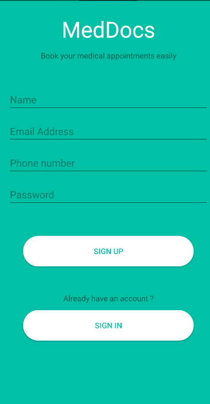 

Figure 3: Sign in Screen  
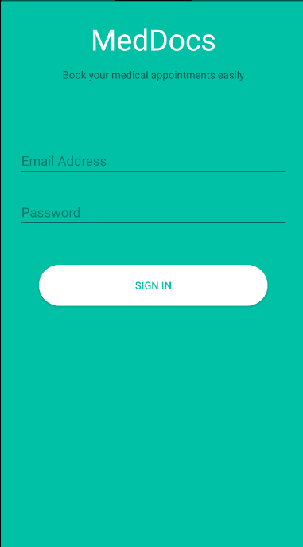 

Figure 4 Selection Page 
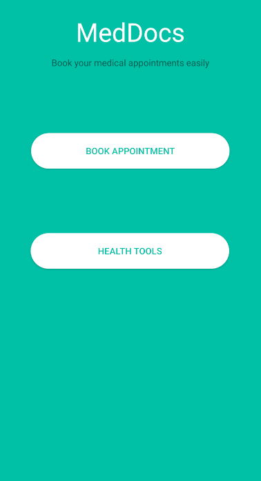 

Figure 5: Booking list 
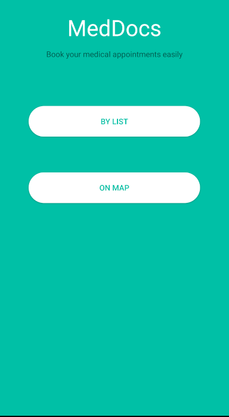 

Figure 6: List of the available locations by map   
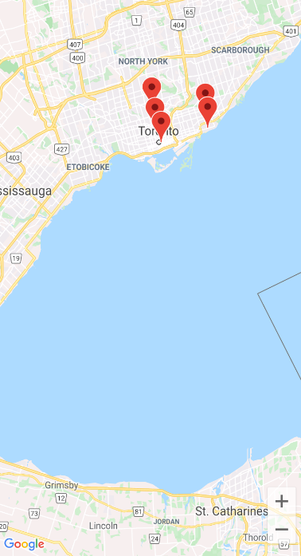 

Figure 7: List of available clients or hospitals 
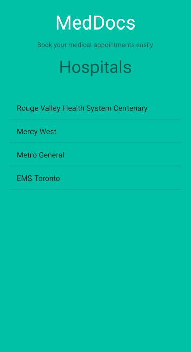 

Figure 8: List of Available Doctors 
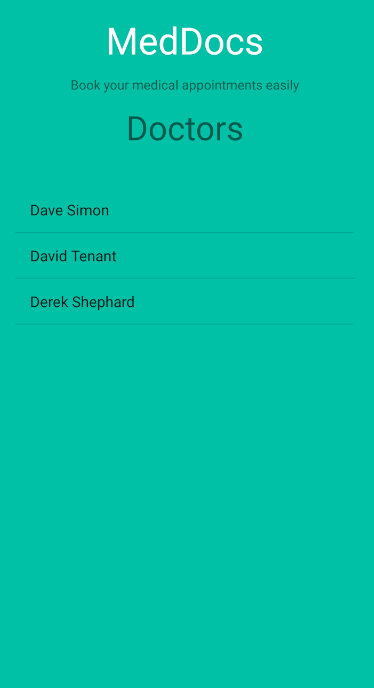 

Figure 9: Time slot per doctor 
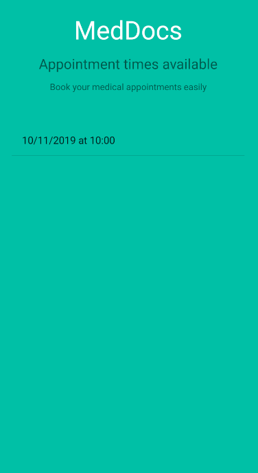 

Figure 10: Confirmation of Appointment 
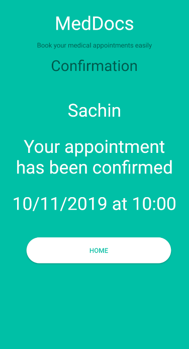 

 Figure 11: Available health tools  
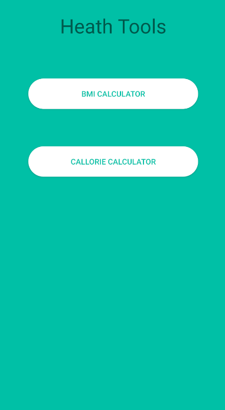 

Figure 12: BMI Calculator API from CDC  
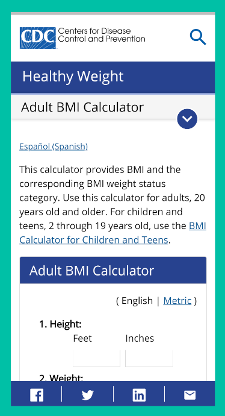 

Figure 13: Calorie Calculator  
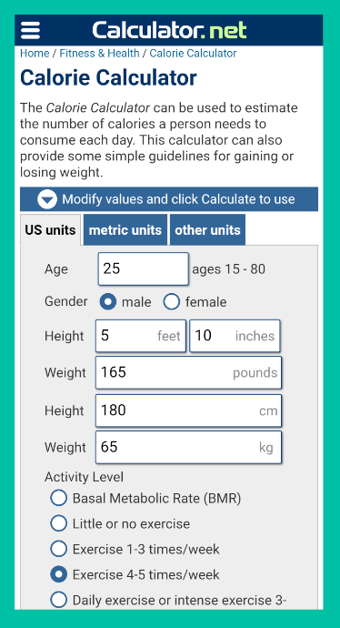 

## HIGH-LEVEL DESIGN:

Technology stack used is primary java under Android studio as both front end and back end. In addition SQLite was used a database which stores all login information and hospital information. Google API was used to create maps and directions to the doctors based on GPS location. 

The database schema used as the following under SQLite for both login information and doctor availability.   

Table 2: user table schema 
Table name: user_table  
NAME 
EMAIL 
PHONENUM 
PASSWORD 

Table 3: hospital table schema 
Table name: hospital_table 
HOSPITAL_NAME 
DOCTORS 
TIME 

When user enters the application, the primary data required to store into the database is the appointment time that selected by the users and hence remove the available time that doctor initially has.
